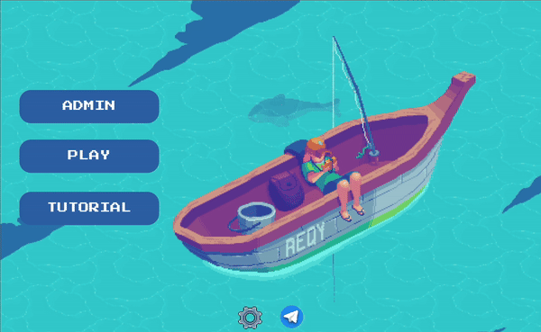

# 🃏 SPACCAFX
> `SpaccaFX` e' un gioco innovativo di carte che e stato creato interamente con JavaFX. Ti permette di divertire con i tuoi amici in modalita multiplayer oppure in modalita sinleplayer contro alcuni Bot. Il livello di difficolta' di essi e completamente regolabile e i meccanismi di gioco so flessibili e modificabili come preferisci. Dimostra chi e il vero campione e scala la Leaderboard!! Scarica ora! 





## DOCUMENTAZIONE
>`Carte`:
> 
> `27 Carte Normali` –> Create da noi
> 
>9 carte `VERME`
>
>9 carte `PESCE`
>
>9 carte `SQUALO`
>
>Ogni seme ha una potenza diversa: Squalo>Pesce>Verme, quindi a parità di numero, vince chi ha il seme più potente
>
>Per rendere più entusiasmante l’esperienza di gioco abbiamo aggiunto `imprevisti` e `probabilità` che potranno aiutare o penalizzare l’utente
>
>`18 Carte Speciali`
>
>9 carte `STELLA MARINA` --> PROBABILITA
>
>9 carte `PESCATORE` -->  IMPREVISTO
>
>Queste due nuove tipologie di carte stabiliscono una nuova gerarchia della “potenza” delle carte: Probabilità>Squalo>Pesce>Verme>imprevisto
>
>Tipi di  `IMPREVISTO`:
>
>1. Non puoi scambiare  
>2. Sei obbligato a scambiare la carta con il mazzo
>
>Dopo ogni imprevisto si passa il turno automaticamente
>
>Tipi di  `PROBABILITA`:
>
>1. Puoi sostituire la tua carta con una dal mazzo
>2. Si lancia un dado, se il numero del dado è uguale al numero della carta si ottiene una vita extra
>
>Il numero di: Carte Normali, Carte Speciali e Vite è settabile dall’utente ad ogni nuova partita /torneo in modo da implementare un extra deck
>
>`Bot`:
>
>Sono giocatori virtuali generati automaticamente dal sistema, hanno la capacità di eseguire in automatico tutte le azioni proprio come un utente reale, con alcune piccole differenze:
>
>1. `Easy Bot`: non ragionano, quindi sceglieranno randomicamente la mossa da svolgere
>
>2. `Advanced Bot`: sono dotati di ragionamento, in fatti in base al valore della propria carta, decideranno se passare il turno o scambiare la carta
>
>`Flow di gioco`:
>
>L’admin si autentica mediante username e password, dopodiché in base alla richiesta degli utenti, imposta una `partita` o un `torneo`.
>
>Ogni partita è composta da 4 utenti, che possono essere 4 persone fisiche, 4 bot o un numero misto tra essi, ogni untene deve avere un nome univoco, altrimenti il sistema darà errore.
>
> Nel caso di un `torneo`, verranno create 4 partite e i vincitori di ogni partita formeranno il tavolo dello scontro finale, che stabilità il vincitore del torneo.  
Una volta che l’admin avrà impostato la partita comunicherà ai giocatori un username e una password che permetterà di entrare nella partita / torneo.  
>
>`Inizia il gioco`: Il sistema distribuisce una carta ad ogni giocatore. Viene stabilito tramite un lancio di `dadi` il mazziere, che graficamente sarà identificato con una `corona`, esso sarà l’ultimo giocatore a giocare, dal secondo turno il mazziere gira in senso orario, quindi partendo dalla sinistra del mazziere.
>
>`Obiettivo`: Ad ogni turno, bisogna riemanare con la carta più bassa per non perdere la propria vita. Quindi se si possiede una carta alta, l’obiettivo è scambiarla con il giocatore alla sinistra che non può rifiutare lo scambio salvo l’intervento di alcuni imprevisti e probabilità.
>
>Il mazziere scambierà la carta con il mazzo.
>
>`Turno 1`: Ogni giocatore guarda la propria carta e decide di scambiarla con al giocatore alla propria sinistra (secondo i criteri descritti nell’obiettivo).
>
>Alla fine di ogni turno vengono scoperte le carte: chi ha la carta più alta, perde una delle M vite, invece chi ha la carta più bassa, vince il turno.
>
>`Turno 2`: Abbiamo quindi un giocatore morto oppure con una vita in meno.
Il mazziere sarà il giocatore che prima era alla sinistra del mazziere. Non è più necessario tirare dadi. Il computer ri-distribusice le carte.
>
>Si continua per i turni successivi finché non rimane UN solo giocatore e dunque tutti gli altri hanno esaurito le vite.
>
>La partita può essere messa in pausa in qualsiasi momento e successivamente se si desidera, ricomincerà dal punto in cui è stata interrotta.

## 📝CONFIGURAZIONE PROGETTO SU INTELLIJ
_Segui i passaggi sottostanti per avere il progetto installato correttamente ._ `DEVI AVERE I PERMESSI NECESSARI PER PROCEDERE!!`

> 1. Scarica `IntelliJ` dal seguente link: [https://git-scm.com/downloads](https://www.jetbrains.com/idea/download/?source=google&medium=cpc&campaign=9736965262&term=intellij+idea&content=602143185970&gad=1&gclid=CjwKCAjwwb6lBhBJEiwAbuVUSgwq11iEkkCStnKvp7T2IMwenLvo4g7rxxaeNugtO371EiT_8QQgQBoCswUQAvD_BwE&section=windows)
> 2. Scarica l'ultima versione di `JavaFX` dal seguente link: https://gluonhq.com/products/javafx/
> 3. Apri `IntelliJ` e importa il progetto utilizzando il link `HTTPS` che trovi cliccando il bottone verde `CODE`
> 4. Implementa la versione di `JavaFX` precedentemente scaricata all'interno del progetto
> 5. Effettua la `RUN CONFIGURATION` per avviare la classe `MAIN`
> 6. Potrai ora apportare modifiche al progetto!

## ⚙️ GIT SETUP
> 1. Scarica GIT dal seguente link: https://git-scm.com/downloads
> 2. Apri il `Prompt Dei Comandi` ed esegui le istruzioni (devi avere GIT Installato):

_Inserisci il tuo username di riconoscimento:_
```sh
  $ `git config --global user.name "Nome Cognome"`
```
_Inserisci la tua e-mail:_
```sh
  $ `git config --global user.email "email@example.com"`
```
_Verifica che il nome sia corretto:_
```sh
  $ `git config --global user.name`
```
_Verifica che l'email sia corretta:_
```sh
  $ `git config --global user.email`
```

## 🤖 SIMPLE APIs
```js
  public static Int Test(); // return something
  public static void ConnectPlayer(IGiocatore giocatore); // Inserisci il giocatore nella partita
  public static void SaveMatch(); // Salva i dati su un file
```
## ✨ FEATURES

## 📦 STRUCTURE

```
├── src/
│   ├── SpaccaFX.js
│   ├── Test.js
│   └── Grafica.js  <–––
├── assets/
├── package.json
└── ...
```

## 🖥️ SOFTWARES USATI
_Qui troverai la lista di software utilizzati_
1. IntelliJ IDEA: https://www.jetbrains.com/idea/
2. Asesprite: https://www.aseprite.org/
3. PixilArt: https://www.pixilart.com/
4. Adobe Photoshop: https://shorturl.at/bcnuN
5. Scene Builder: https://gluonhq.com/products/scene-builder/ 
6. Telegram: https://web.telegram.org/a/
